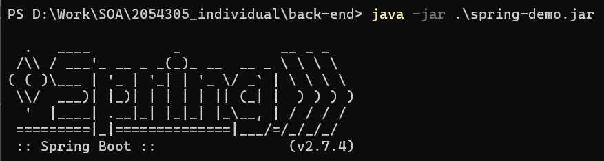
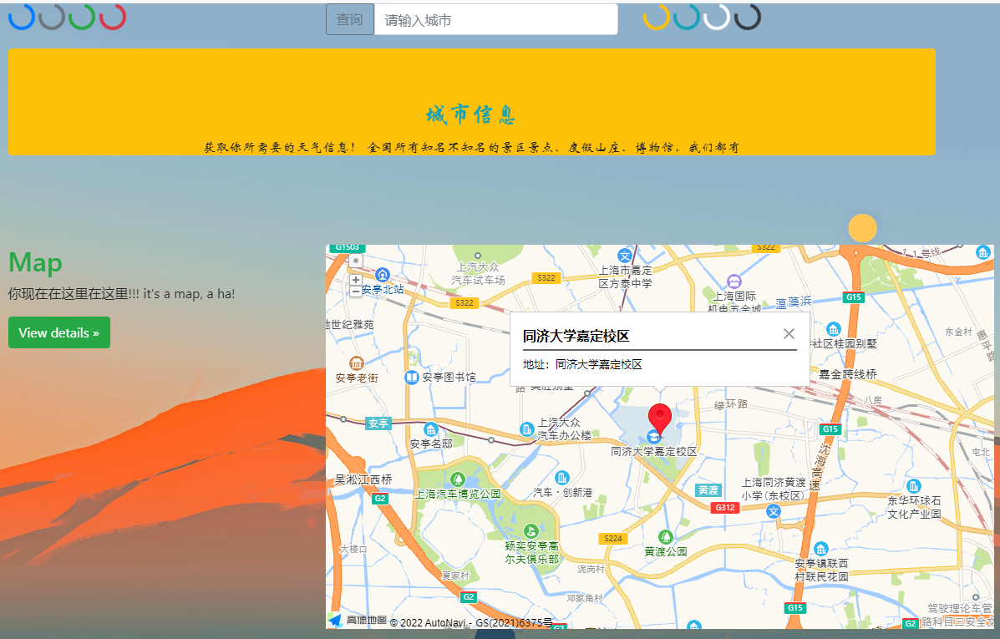

# 提交的项目运行

## 首先运行后端

需要端口8082空闲

##### 方法一（运行方便，但不方便关闭，不推荐

直接点击back-end\spring-demo.jar

##### 方法二

```shell
java -jar .\spring-demo.jar
```

后端运行jar包（不知为何mybatis打包后不能获取数据库的数据



## 然后运行前端

点开index.html即可


# 项目展示


## 主页


跳转功能：点击view details跳转


小设计：随机图片与名言


## 疫情速报

点击viewDetial将跳转到实时动态地图


显示当日疫情信息


## 出行防疫政策


二级选择，先选择省份，并显示相应的城市


显示相关信息


## 城市信息

将显示天气、显示当前所在地、旅游景点的信息



查询获得目标城市的天气、景点信息


# API


## 景点http://api.tianapi.com/scenic/index

通过城市名获取景点


## 城市编码http://apis.juhe.cn/springTravel/citys

防疫政策支持城市：通过城市名获得city_code


## 防疫政策http://apis.juhe.cn/springTravel/query

通过出发和到达城市，获得防疫政策、健康码等信息


## 疫情通报http://api.tianapi.com/ncov/index


## 天气预报https://restapi.amap.com/v3/weather/weatherInfo

通过高德的城市码、区县码，获取这个地区的天气信息


## 标题图片https://v2.alapi.cn/api/one/photo

每日获取一个图片以及引用名言


# 后端

使用springboot，目的是防止密钥key暴露在前端

```java
@SpringBootApplication
public class SpringDemoApplication {

    public static void main(String[] args) {
        SpringApplication.run(SpringDemoApplication.class, args);
    }

}
```

**RestController**

```java
@RestController
public class nCovInfoController {
    /**
     无参数接口
     */
    @CrossOrigin
    @RequestMapping(value="/api/get_nCovInfo",method = RequestMethod.GET)
    public String getDefault_nCovInfo(){
        return nCovInfo.get_nCovInfo();
    }
}


public static String get_nCovInfo() {
        //java环境中文传值时，需特别注意字符编码问题
        String httpUrl = "http://api.tianapi.com/ncov/index";
        String httpArg = "key=767d51bc9cce27e05421a1a9cd7f4c4f";
        String jsonResult = request.request(httpUrl, httpArg);
        System.out.println(jsonResult);
        return jsonResult;
    }
```

## MyBatis

### 数据库

**需要数据库的原因：**

- 高德天气查询需要城市码city_code
- 天气查询是通过城市名city_name模糊查询
- 高德仅提供了映射表xlxs文件，可以直接xlxs导入到数据库

```sql
DROP TABLE IF EXISTS `gaode_cityCode`;
CREATE TABLE `gaode_cityCode`  (
  `city_name` varchar(255) CHARACTER SET utf8mb4 COLLATE utf8mb4_0900_ai_ci NOT NULL,
  `city_code` int NOT NULL
) ENGINE = InnoDB CHARACTER SET = utf8mb4 COLLATE = utf8mb4_0900_ai_ci ROW_FORMAT = Dynamic;
```


建立了mapper映射

CityMapper.java

```java
public interface CityMapper {
    /*???????*/
    List<gaode_City> selectAll();

    List<gaode_City> selectByCityName(String city_name);
}
```

CityMapper.xml

```xml
<mapper namespace="com.example.mapper.CityMapper">

    <select id="selectAll" resultType="gaode_city">
        select *
        from gaode_cityCode;
    </select>
    <select id="select" resultType="gaode_city">
        select *
        from gaode_cityCode
        where
            city_name=#{city_name}
    </select>
    <select id="selectByCityName" resultType="gaode_city">
        select *
        from gaode_cityCode
        where
            city_name like #{city_name}
    </select>


```

模糊查询

```java
        //1. 加载mybatis的核心配置文件，获取 SqlSessionFactory
        String resource = "mybatis-config.xml";
...
            //3. 获取mapper接口代理对象
            CityMapper cityMapper = sqlSession.getMapper(CityMapper.class);

            //4. 执行方法
            // 接收参数
            cityName = "%" + cityName + "%";
            List<gaode_City> cities = cityMapper.selectByCityName(cityName);
            System.out.println(cities);
...
```

# 前端

使用bootstrap， jquery

html有5个，脚本文件写在script.js中

1. 导航栏

   ```html
   <nav class="navbar navbar-expand-lg navbar-light bg-light">
   	  <a class="navbar-brand" href="#">导航栏</a>
   	  <button class="navbar-toggler" type="button" data-toggle="collapse" data-target="#navbarNavDropdown" aria-controls="navbarNavDropdown" aria-expanded="false" aria-label="Toggle navigation">
   		  <span class="navbar-toggler-icon"></span>
   	  </button>
   	  <div class="collapse navbar-collapse" id="navbarNavDropdown">
   		  <ul class="navbar-nav">
   			  <li class="nav-item active">
   				  <a class="nav-link" href="index.html">主页 <span class="sr-only">(current)</span></a>
   			  </li>
   			  <li class="nav-item">
   				  <a class="nav-link" href="nCov.html">疫情速报</a>
   			  </li>
   			  <li class="nav-item">
   				  <a class="nav-link" href="policy.html">出行防疫政策查询</a>
   			  </li>
   			  <li class="nav-item">
   				  <a class="nav-link" href="city.html">城市信息</a>
   			  </li>
   		  </ul>
   	  </div>
     </nav>
   ```

2. jquery

   ```html
   $(".newsCardList").append("<div class=\"card\">\n" +
   						"<div class=\"card-body \">\n" +
   						"<h5 class=\"card-title text-danger\">"+ news[i].title +"</h5>\n" +
   						"<p class=\"card-text text-info\">"+ news[i].summary +"</p>\n" +
   						"</div>\n" +
   						"</div>")
   ```

3. 网页结构布局：bootstrap，每一行row分为12个小格，可以用col来分割他们

   

4. 从后端获取数据

   ```js
   function get_json(url){
       let str_json
       $.ajaxSettings.async = false;
       $.get(url,function (data,status){
           str_json = data
           // console.log(str_json)
           json = eval("("+data+")");
       })
       // return str_json;
       return json;
   }
   ```

